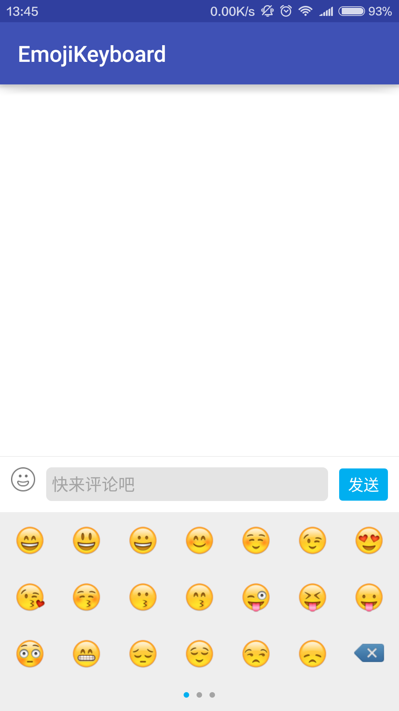
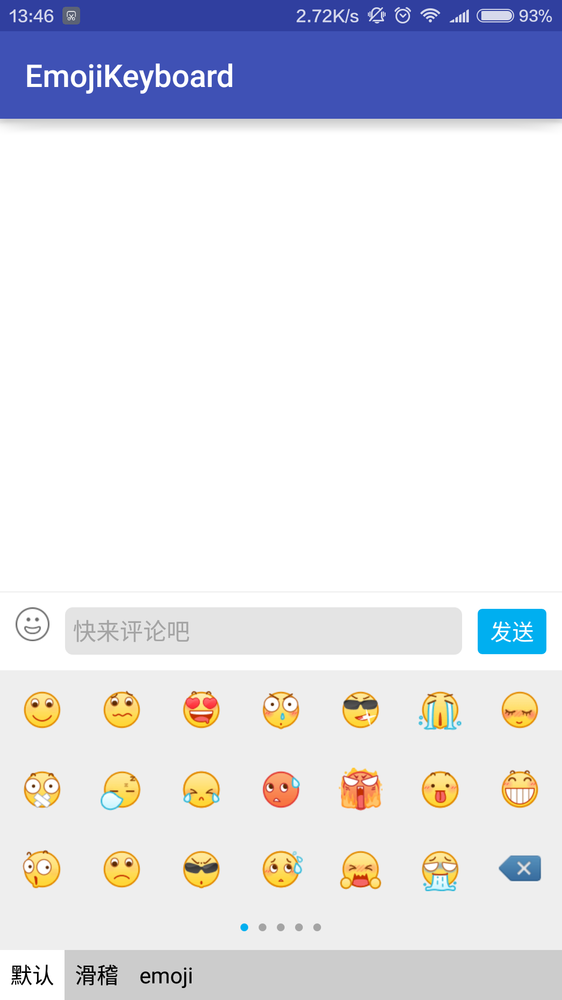

#EmotionKeyboard
一个自定义的emoji表情键盘，自用，效果不是很好，重构中，附送QQ表情，滑稽表情,效果图如下：

##效果图




##使用说明
```xml
    <LinearLayout
        android:id="@+id/send_layout"
        android:layout_width="match_parent"
        android:layout_height="wrap_content"
        android:orientation="vertical"
        android:layout_alignParentBottom="true" >
        <include layout="@layout/include_comment_layout" />

        <com.maplejaw.library.EmoticonKeyboard
            android:id="@+id/mEmoticonKeyboard"
            android:layout_width="match_parent"
            android:layout_height="wrap_content"/>
    </LinearLayout>
```
```java
   @Override
    protected void onCreate(Bundle savedInstanceState) {
        super.onCreate(savedInstanceState);
        setContentView(R.layout.activity_single);
        mEmoticonKeyboard= (EmoticonKeyboard) this.findViewById(R.id.mEmoticonKeyboard);
        mEditText= (EditText) this.findViewById(R.id.editText);
        mEmoticonKeyboard.setupWithEditText(mEditText);
        ....

    }
```

如果你想自定义表情集，可以使用
```java
mEmoticonKeyboard.setupWithEditText(mEditText,...)
```
怎么显示？   
使用`EmojiconTextView ` 或者不想使用EmojiconTextView ，可以使用 `EmojiconHandler.handleAllEmoticon`
##键盘闪动问题

由于实在太懒，请参考[微信解决方案](https://github.com/Jacksgong/JKeyboardPanelSwitch),[简书网友解决方案](http://www.jianshu.com/p/328784b363b6)。

## Thanks
部分代码修改自emoji库[emoji_icon](https://github.com/rockerhieu/emojicon)